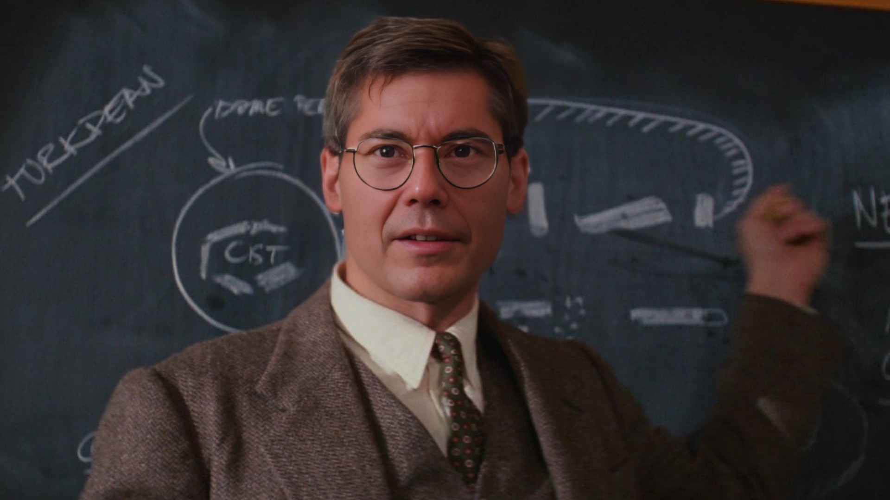

# **ABOUT**

# Get to know  
Glenn Kelly 006

Glenn A Kelly was born in Maine, USA. His father was a career US Air Force pilot, and his mother an avid artist. Growing up as a military brat Glenn lived in Okinawa, Japan, and California as his father was transferred to different assignments.

Glenn attended San Diego State University where he received a Bachelor's in Telecommunications and Film. Desiring to serve his country he joined the US Army and served honorably for four years. Glenn worked at Microsoft Corporation in Washington for 12 years where he met his wife and started a family.

Glenn, his wife, and two children moved to California in 2015 to join DreamWorks Animation as a Technology Manager, realizing his childhood dream of working in the entertainment industry.

In 2019 Glenn received a Master's in Business Administration from The Master's University.

# Bondservant, husband, and father

Glenn Kelly 006 is a bondservant, husband, and father who started this site in 2020 with the vision to connect with people of all ages and walks of life.

## **Who is this site for?**

This site explores in an open and fun way the topics of faith, fitness, and focus

- Do you want to live your life to the fullest?

- Do you have dreams and ambitions but don't know where to begin or need encouragement?

Join and engage with 006 on this journey together.

## **Connect with Glenn Kelly 006**

- [YouTube](https://m.youtube.com/@GlennKelly006)

- [Instagram](https://www.instagram.com/GlennKelly006/)

- [Facebook](https://www.facebook.com/GlennKelly006/)

## **Disclaimer**

The views and opinions expressed on this site are solely my own and do not necessarily reflect the views of my employer or any affiliated organizations.

Glenn Kelly 006 is not affiliated with any James Bond copyright holder and is an unofficial entity.
