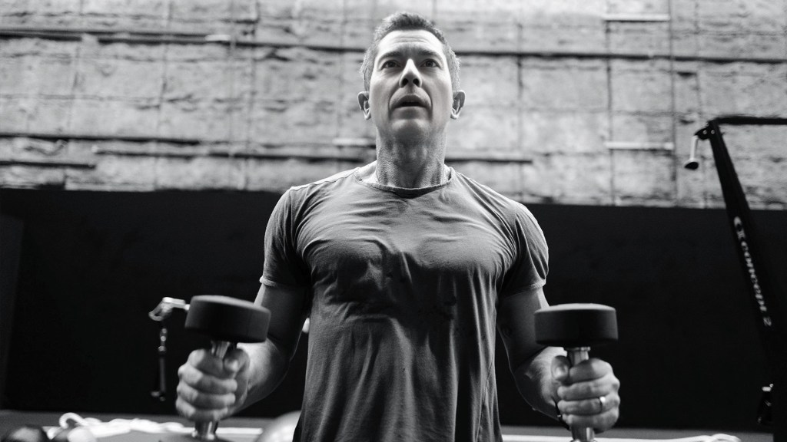

> But if any of you lacks wisdom, let him ask of God, who gives to all generously and without reproach, and it will be given to him.
> 
> James 1:5

This post explores the overall approach that I have taken towards my current workout strategy and shares some basic information about strength training. After you have determined your fitness goal (covered in the post - [What's your fitness goal?](https://glennkelly006.wordpress.com/2020/06/15/fitness-journey/)) these are good basics to begin to make your personal workout program.

### Body Building Basics

> People over 50 should strength-train all major muscle groups at least two to four times per week to gain muscle.
> 
> American College of Sports Medicine

- **Muscle actions**: concentric, eccentric, and isometric. Good programs include all actions.

- **Compound vs. isolation movements**: Compound or multi-joint exercises provide more bang for the buck in terms of activating multiple muscles at the same time. As you get older and do not have a lot of time to spend in the gym and are more prone to injury your exercise program should prioritize the compound movements for maximum efficiency.

- **Exercise order**: More demanding multi-joint exercises should be performed **before** less demanding exercises, and isolation exercises. This way the energy demands on your body are prioritized for maximum results.

- **Proper # of Sets**: 3-4 sets per exercise is deemed best by experts to not overtrain.

- **Rest between exercise sets**: depends on the periodization emphasis (covered in more detail in [006 Workout Advanced](https://glennkelly006.wordpress.com/2020/10/10/006-workout-advanced/) post). The general guidance is to rest enough to allow for maximum effort in the next set.

- **Rest between workouts**: 24 to 48 hours rest between workouts. You start to lose gains if you rest 3 days or more.

- **Do NOT train to failure** - Research indicates that training to failure adds a lot of fatigue for minimal extra muscle stimulation, which then impacts the effectiveness of the rest of your workout. It is more harmful as the last reps have poor technique and risks injury. Keep in mind though that a slow rep where you fight through is not poor technique but rather "grinding" through a rep which aids hypertrophy.

### Why I took a Hybrid Weekly Workout Approach

There are so many approaches to take in working out with varied guidance including:

- People over 50 years old should just do whole body exercises and do not perform isolation exercises and to rest more (48 hrs for full recovery).

- Another source indicated a two days workout performing body part splits and then taking one day off is best.

My hybrid plan incorporates elements from different approaches and works for me to balance things out. I find that it is difficult to work out 5 days straight so there often are additional rest days that I throw in. This is fine as I’m in this fitness journey for the long term and not just for short term gains.

Basically the Hybrid Weekly approach I take has full body workouts on Mon & Fri. With body part splits during the week. I put Legs in the middle of the week on purpose to give my other body parts a good rest period before hitting them on Friday.

### Hybrid Weekly Approach

Whole body days (Power Circuits 2x a week) + Split body part days = exercising each body part 3 times a week. The initial inspiration for this approach was taken from the Daniel Craig workout that he used to prepare for the James Bond movies.

- **Full Body Circuit** days = 3 sets of each exercise but done as a series. First exercise, second exercise

- **Split body** part days = 4 sets per exercise, Do all 4 sets then move to next exercise

- **Reps** - Controlled and perfect form reps. My goal is more fast twitch so do not do my reps slowly but rather explode and then slowly lower. 1:2 ratio. 

Why I like this approach is that it seems to fit in with all the overall guidance to hit each body part 3 times a week and is a hybrid of the full body approach (which to me would get boring if I did the same thing every workout day) and split body approaches (which pair up alternating/opposing muscle groups when possible) and also throw in some isolation moves.

### Warm-up

- General guidance for your warm up is 10 minutes but really has to be what works for you and is effective.

- The goal of your warm-up is to get the heart rate up and blood pumping. Typically I run in place for a minute or two and do jumping jacks or dance around, get excited and ready for the workout.

- Dynamic stretch of the body parts that will be the focus of the workout

- If full body session then overall dynamic movement to warm up the joints and muscles

- Before the first exercise practice the movement with no weight or minimal weight

- Review the best practices of body position and movement for the excercise

### Recovery

- **Days off** are to be recovery but not inactivity (light cardio recommended & stretching)

- I’m learning more and more that it really depends on what my body is telling me

- If I trained too hard my body definitely lets me know

- If you are sick or cannot train due to some other life circumstance it is not a huge deal so do not beat yourself up. Remember this is a life long fitness journey and is not a short term pursuit for short term gains.

### Stretching

- **Stretching** is important to reduce chance of injury and to retain a full range of movement as you age.

- **Dynamic stretching before** lifting to limber and prepare your muscles for exercise and get your range of motion.

- **Static stretching after** lifting as it lengthens your muscles and ligaments and starts to get the lactic acid out. There is research that indicates that static stretching is actually not a good idea before a workout as it does not reduce the chance of injury and that elongating the muscle before you workout actually makes it harder for you to activate your muscles thoroughly during exercise and reduces your level of performance.
    - When doing static stretching the goals is to stretch 60 seconds total for each stretch. Doesn’t matter if 6 - 10 second stretches at a time just needs to add up to 60 seconds.

### Fundamental Principles

**High-intensity interval training (HIIT) Cardio** - For my training goals I focus more on High-intensity interval training (HIIT) vs. Steady-state training. Ideally if you can do your cardio in the morning before eating. When I do my workouts I use weights but limit the amount of rest so I get a cardio benefit from my workout.

**Substitute/change up exercises** - If you do not have the right equipment or have an injury that prevents you from doing a particular movement substitute/change up your exercises. It is also good to keep your body guessing and to activate the muscles in a new and challenging way so perform a variety of movements. Also consider that every person is different and some movements just are really uncomfortable so find the right exercises that work for you that you can perform with good form and target the muscles you are trying to engage.

**Measure progress** - body weight weekly, body measurements and pictures on a monthly basis. I’ve been doing this fairly diligently. It is motivating as the mirror doesn’t lie.

**Keep Consistent & be patient** - Stick with it and you will see gradual results. Do not be discouraged if the gains or losses are not progressing as fast as you would want. Persistence and patience will be rewarded.

> I find it really helps to have music when I workout! What do you listen to when you workout?

#### Connect with Glenn Kelly 006

- [YouTube](https://m.youtube.com/@GlennKelly006)

- [Instagram](https://www.instagram.com/GlennKelly006/)

- [Facebook](https://www.facebook.com/GlennKelly006/)
