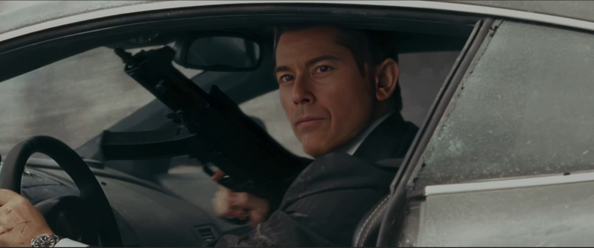

> And do not be conformed to this world, but be transformed by the renewing of your mind, so that you may approve what the will of God is, that which is good and pleasing and perfect.
> 
> Romans 12:2

What is his story? Where did he come from? In short he is a fictional role playing character that I created back in High School.

## Role Playing Games

Back in High School my close friends and I used to play all sorts of role playing games like Advanced Dungeons & Dragons, Top Secret, and Gamma Wars (a hybrid game that we made up together). For those unfamiliar with these types of games there is basically a game master who is the story teller that sets the game mission or campaign, making up the plot line, premise/setting, and portrays the non-player characters. The other participants create their unique characters and play the game as this character, making their choices of which way to go and what they want to do. I had very imaginative friends that were amazing story tellers who enjoyed being the game masters and I loved being the one playing the game slaying dragons, rescuing the damsel in distress, or saving the world/universe.

## 006 Character

I created 006 as a character for the role playing game Top Secret. Basically set in the modern world this role playing game allows players to become secret agents and go on missions. To start with you have to create your character. The character has attributes like Strength, Willpower, Courage, Charm, Intelligence, and Coordination.

<figure>

<figcaption>

Top Secret Character Sheet

</figcaption>

</figure>

006 was a British Secret Agent whose standout qualities were his charm, knowledge, and coordination. On his many Top Secret game missions he would partner up with 001 (played by my friend Jon) who excelled in Strength and Courage. 006 is not to be mixed up with the character from the movie Goldeneye. In the Top Secret game my character had the codename 006 as I didn't want to be mistaken as 007 but rather be his colleague.

I have so many fond memories playing various role playing games growing up with my friends. We had vivid imaginations and shared many laughs as we adventured together. You must understand that we did not have many video games growing up or Virtual Reality so had to make everything up in our minds.

### **What games did you play growing up? Did you ever create fictional characters and role play?**

#### Connect with Glenn Kelly 006

- [YouTube](https://m.youtube.com/@GlennKelly006)

- [Instagram](https://www.instagram.com/GlennKelly006/)

- [Facebook](https://www.facebook.com/GlennKelly006/)
