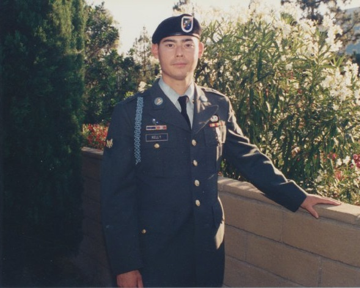

> I can do all things through Him who strengthens me.
> 
> Philippians 4:13

Since I was little I always dreamed that I would one day produce/direct a major motion picture. My dad was into photography and we had various film cameras growing up. Yes I'm old and cameras actually used film and not digital image sensors.

<figure>

<figcaption>

Old film cameras

</figcaption>

</figure>

In Junior High my friends and I used to make stop action animation films. In High School I took a still photography class and would often make fun videos with my friends. Some of my fondest memories are of the goofy videos we would make.

## Acting and directing

In my High School Humanities class I would write, direct, and perform in satirical short skits which were well received by the students but not particularly by the faculty as we made great fun of the classics. It was nerve wracking for sure but was well worth the audience laughs and accolades. Another notable High School project was a historical visual presentation a couple of classmates and I made that was actually shown to the entire school body. When I went to San Diego State University (SDSU), Film was my major and for classes we made multiple videos and films.

<figure>

<figcaption>

San Diego State University (SDSU)

</figcaption>

</figure>

After getting my degree in Film at SDSU I started a small production company with my friend and we wrote a script together and collaborated on a number of projects.

<figure>

<figcaption>

Bailey Kelly Productions (BKP)

</figcaption>

</figure>

None of our projects took off and after a couple years of trying to get something off the ground we parted ways.

## Dream takes a turn

Taking a pause on my dream of motion picture greatness I pursued another dream which was to serve in the military. That certainly was a humbling experience and a time of great growth. In particular my spiritual growth as I earnestly sought out a relationship with God. After getting out of the Army I dedicated my life to the Lord.

<figure>

<figcaption>

Ranger Kelly circa 1994

</figcaption>

</figure>

## AV Ministry

Over the past 25+ years I have served on the Audio Visual teams at a couple different churches where I have been able to use and hone my skills in audio/video production.

<figure>

<figcaption>

Serving with my Brothers @Oak Hill Bible Church

</figcaption>

</figure>

At Oak Hill Bible Church I served as Video Producer and Director of studio live streaming services/programs during COVID lockdowns and continue to serve now in the AV ministry..

If you live in the area or are visiting come worship with us at [Oak Hill Bible Church](http://oakhillbible.com).

<figure>

<figcaption>

Click image to go to the Oak Hill Bible Church YouTube Channel

</figcaption>

</figure>

For amazing Bible teaching and resources to apply biblical discernment to all you do subscribe to the [Oak Hill Bible Church YouTube channel](https://www.youtube.com/channel/UCsLyjUBBEVGLxS5q-oiJ6Qw?sub_confirmation=1).

## It's official I'm in IMDb

Part of my dream has been fulfilled in the last 10 years while working at DreamWorks. I have an IMDb entry with multiple film credits to my name.

<figure>

<figcaption>

Click on the image above to go to my IMDb entry

</figcaption>

</figure>

I still have my original dream to this day of wanting to direct/produce a major motion picture. I have story ideas that I continue to develop.

As with anything I need to check my motives and seek everything for God's glory and His perfect timing. Who knows what is possible. Never give up on your dreams!

#### Connect with Glenn Kelly 006

- [YouTube](https://m.youtube.com/@GlennKelly006)

- [Instagram](https://www.instagram.com/GlennKelly006/)

- [Facebook](https://www.facebook.com/GlennKelly006/)
