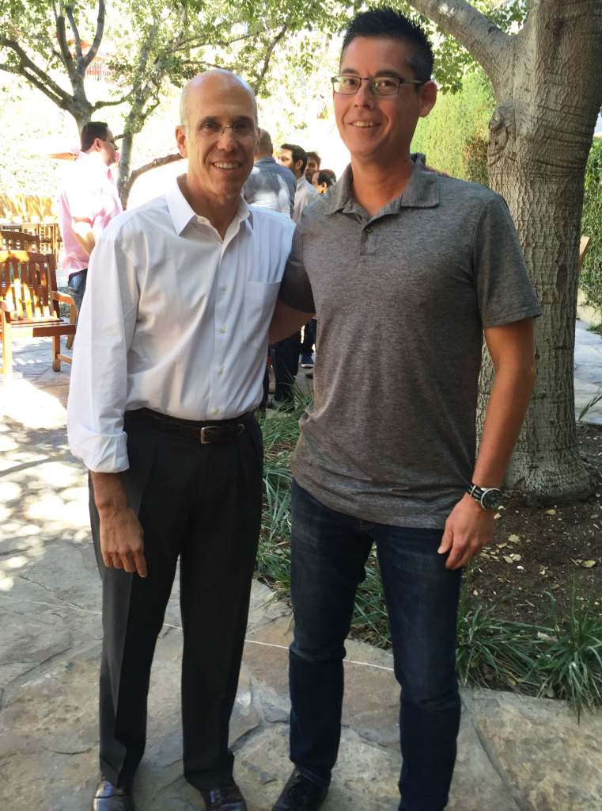

### **The dream is born**

> The heart of man plans his way,  
> But Yahweh directs his steps.
> 
> Proverbs 16:9

Back in High School I decided that I wanted to be in the motion picture business and be a filmmaker. My heroes back then and to this day are George Lucas and Steven Spielberg.

<figure>

<figcaption>

Steven Spielberg and George Lucas

</figcaption>

</figure>

I wanted to make films like they did. I received my film degree from San Diego State University and started my own little production company with a friend. After a few years of trying to develop our ideas the partnership fizzled and the dream seemed to be out of reach.

### **The journey takes different paths**

As doors closed other opportunities opened up and my career path took many different courses. After serving in the Army I committed my life to the Lord and He has continually blessed me since then. I worked for 12 years at Microsoft, was briefly a Police Officer (another dream I had), worked at a Christian non-profit for a few years but was still discontent and felt like I was not doing something that I was passionate about.

### **Wife encouraged me to pursue original dream**

My wife started to notice a pattern with my work. That every 2 years or so I would get dissatified with my job and restless and look for something else. I was always looking for a better opportunity. There is much to be said for us to not have our joy or self worth be in our work and to be content and thankful for what you have. However that does not mean that you cannot dream and pray that the Lord will help open up doors for other job opportunities. In early 2015 many life circumstances all culminated in our family's decision to start prayerfully and earnestly look for job opportunites in California. My wife was born and grew up in California and most of my childhood, 3rd grade through college and beyond were in California. My wife encouraged me to assess my skills and job experience and apply for suitable jobs in the entertainment industry which was my original dream.

https://www.youtube.com/watch?v=Qe3D8XHy85M

### **Research, job applications, and prayer**

I started researching the entertainment industry and seeing where my education and skills would be a good fit to be able to provide for my family and also take me closer to achieving my High School dream. I honed my job search and applied to many different studios and postions, and prayed, and waited. There were a few nibbles on my applications but mostly silence. Then one day I was contacted by DreamWorks Animation and after several interviews I was offered a position to work there and accepted the job. Two weeks later I was living in California in a hotel and on the job while my wife and kids were packing up our home in Washington and putting it up for sale. It turns out that my path into the entertainment business was a very circuitous one through the tech industry.

<figure>

<figcaption>

Jeffrey Katzenberg and 006

</figcaption>

</figure>

> Have you placed your trust in the Lord and asked Him to help you achieve your dreams that will align with His will for your life and bring glory to Him?

I continue to pinch myself daily that I work at a movie studio and thank the Lord for opening up the doors and blessing me and my family in innumerable ways.

#### Connect with Glenn Kelly 006

- [YouTube](https://m.youtube.com/@GlennKelly006)

- [Instagram](https://www.instagram.com/GlennKelly006/)

- [Facebook](https://www.facebook.com/GlennKelly006/)
