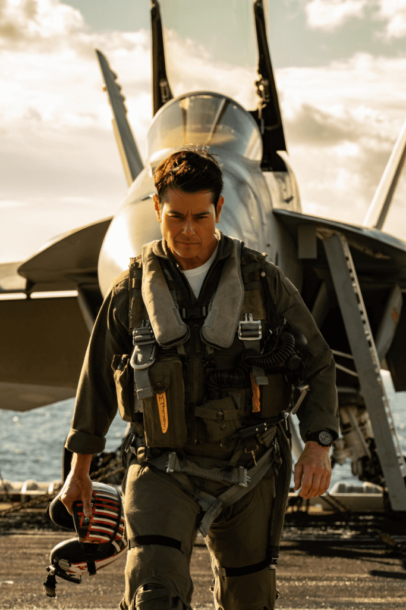
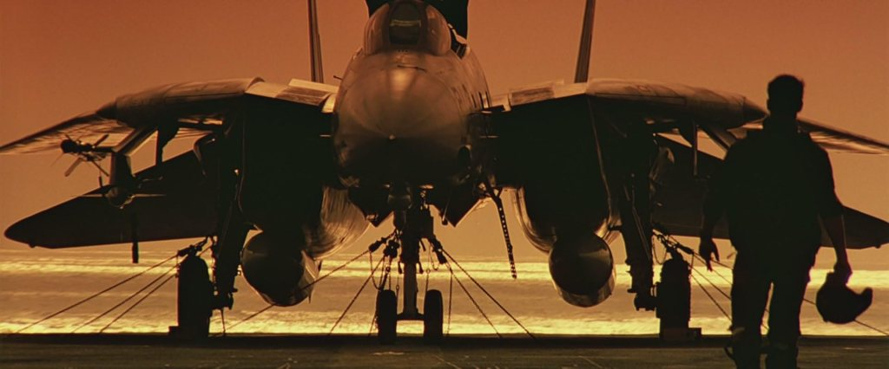

> Honor your father and your mother, that your days may be long in the land that the LORD your God is giving you.
> 
> Exodus 20:12

When I was a kid there was so much that I wanted to do when I grew up. My father was a major influence on me and when I was growing up I wanted to be just like my dad.

### **I want to be a pilot like my father**

Being the son of a United States Air Force Officer, living on military bases from as early as I can remember in Okinawa, Japan, and California I was around airplanes pretty much all my life. I looked up to my dad and wanted to be just like him. He would come home in his flight suit after flying different missions or working at the office. I would always show him respect and call him sir. He would joke and say don't call me sir, call me Major.

Whenever we would drive on or off the base people would salute my Dad as he was an officer and he would be given respect for his rank. Also being a pilot in the Air Force has to be one of the coolest jobs in the world. At least that was what I thought as a young boy.

My room had pictures of airplanes and I would make model airplanes and have them on display. I remember vividly one toy I had that was an aircraft carrier about 6 feet long that had a string that I would tie to a bed post and I could launch small plastic airplanes from the carrier and it would slide up the string and then pivot and come back down, and I could guide it back for a safe landing. I also had a cool helicopter game that ran on batteries and the helicopter was able to fly around in a circle as it was attached by a metal rod, but it could pick up little plastic cargo containers and you could drop them off. I would spend hours and hours playing with these and other flying toys inside and outside and think of the day that I would be able to fly a plane like my dad.

On I think my 9th birthday my dad took me to the control tower at Edwards Air Force base with my friends and we got to play around in there for awhile. And I think either on that birthday or a different one my dad took me up in a Cessna which was fun but I got air sick. I didn't particularly like the feeling of bouncing around. That was probably the first indicator that maybe flying wasn't my thing.

My father had wanted to be an astronaut and part of the reason why my parents chose my first name Glenn was because of John Glenn the astronaut. I dreamt of not just becoming a hot shot pilot but becoming an astronaut which was even cooler.

### **Failed to meet Air Force vision requirements**

As I grew older my thought was to go to the Air Force Academy and be an officer and fly planes like my father.

I looked into the requirements and everything was fine except for my vision. I am very near sighted and have worn eyeglasses since the 4th Grade. This would be the key requirement that disqualified me from being a pilot in the Air Force. There was surgery to correct your vision but even that was new and risky at the time and was not good enough for the Air Force. I was crushed as that door was shut and I had to come up with a different path.

There is still a desire within me to learn to fly and maybe the Lord will allow me to pursue that still in some capacity as a hobby. I am happy and thankful for all of the opportunities and paths that I have taken since then to pursue different dreams and trust that the Lord had and still has my best interests in mind.

#### Connect with Glenn Kelly 006

- [YouTube](https://m.youtube.com/@GlennKelly006)

- [Instagram](https://www.instagram.com/GlennKelly006/)

- [Facebook](https://www.facebook.com/GlennKelly006/)
