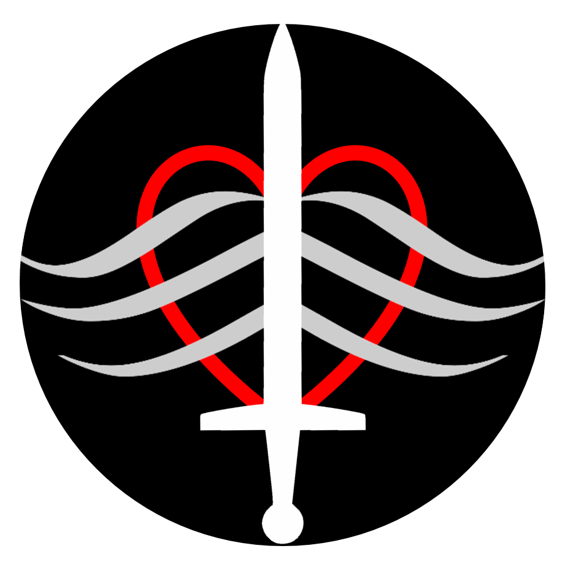

The logo is a combination of three symbols on a black background. Each symbol has significance and the logo visually portrays the motto "Live and Love in the Lord!"

### **Water = Living Water = Live**

<figure>

<figcaption>

Before I was saved my life motto was "Live". To just survive.

</figcaption>

</figure>

| **Meaning** | **Application** |
| --- | --- |
| “Whoever believes in me, as the Scripture has said, ‘Out of his heart will flow rivers of living water.'” (John 7:38) | Our lives are to be a living sacrifice to honor our Lord and love others. |

### **Heart = Transformed Heart = Love**

<figure>

<figcaption>

As I grew older my life motto was "Live and Love" as I desired love.

</figcaption>

</figure>

| **Meaning** | **Application** |
| --- | --- |
| “And I will give you a new heart, and a new spirit I will put into you. And I will remove the heart of stone from your flesh and give you a heart of flesh.” (Ezekiel 36:26) | Our hearts must be transformed by the Lord to carry out the good works that He has planned for us. |

### **Sword = Sword of the Spirit = Lord**

<figure>

<figcaption>

My motto is "Live and Love in the Lord" as there is only life and love in the Lord.

</figcaption>

</figure>

| **Meaning** | **Application** |
| --- | --- |
| “…and take the helmet of salvation and the sword of the Spirit, which is the word of God,” (Ephesians 6:17) | It is facing up and pointing the way for our life and is intended for us to take up daily and put first. |

### **Black Background**

| **Meaning** | **Application** |
| --- | --- |
| “Let your light shine before men in such a way that they may see your good works, and glorify your Father who is in heaven.” (Matthew 5:16) | The background of the logo is black as the world we live in is filled with darkness (moral depravity, wickedness, evil) and desperately needs the light of truth from the Lord. |

If you live in the area or are visiting come worship with us at [Oak Hill Bible Church](http://oakhillbible.com).

<figure>

<figcaption>

Click image to go to the Oak Hill Bible Church YouTube Channel

</figcaption>

</figure>

For amazing Bible teaching and resources to apply biblical discernment to all you do subscribe to the [Oak Hill Bible Church YouTube channel](https://www.youtube.com/channel/UCsLyjUBBEVGLxS5q-oiJ6Qw?sub_confirmation=1).
