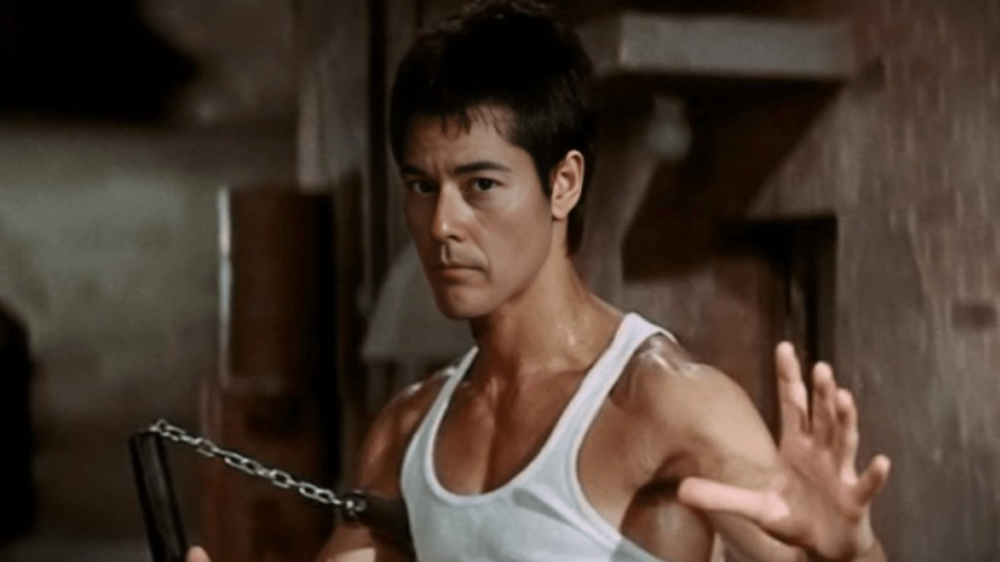

> Blessed be Yahweh, my rock,  
> Who trains my hands for war,  
> My fingers for battle;  
> My lovingkindness and my fortress,  
> My stronghold and my deliverer,  
> My shield and He in whom I take refuge,  
> Who subdues my people under me.
> 
> Psalm 144:1-2

There are many benefits to studying martial arts including physical fitness, self confidence, and mental discipline. Martial arts are an important component of my life that I have devoted several years of practice and study to, and have benefited me in many ways.

https://youtu.be/NlTyJhbTxxo

### What are the Martial Arts?

> Martial arts are codified systems and traditions of combat practiced for a number of reasons such as self-defense; military and law enforcement applications; competition; physical, mental and spiritual development; and entertainment or the preservation of a nation's intangible cultural heritage.
> 
> Wikipedia definition

> To me, ultimately, martial arts means honestly expressing yourself. Now, it is very difficult to do. It has always been very easy for me to put on a show and be cocky, and be flooded with a cocky feeling and feel pretty cool and all that. I can make all kinds of phoney things. Blinded by it. Or I can show some really fancy movement. But to experience oneself honestly, not lying to oneself, and to express myself honestly, now that is very hard to do.
> 
> Bruce Lee

### Motivations to study

I have always been interested in understanding the martial arts. Perhaps this is inherently something that men are drawn to as they want to understand how to fight and to win.

My father and I would watch heavyweight boxing matches together including Muhammad Ali and Mike Tyson. We would study the moves in slow motion over and over as we were fascinated by the precision, timing, technique, and power.

A key motivation for me was to be able to learn how to defend myself well and to be able to protect the ones I love. As I am half Japanese I wanted to understand Japanese culture of which Bushido and Ninjitsu are prominent.

### What forms have I studied

I have taken classes and have been formally trained in Judo (when I was little), Wrestling (in Junior High), Karate (Japan Karate Federation - Shito-Ryu Itosu-Kai during High School, achieved Brown Belt), Aikido (Steven Segal seminar), Fencing (college course), Military combat tactics (while in Army), Kendo (classes), and Police defensive tactics (Police Academy).

I have studied Bushido, Ninjistsu, Jeet Kune Do, and many martial arts philosophies.

### Cool time that I was one with the force

In the Star Wars movies and stories there is the concept of "the force". There was one moment in a Karate Tournament when I was 17 years old where I was in sparring match and had won my way to the final round where I believe I experienced what that is like.

My opponent had just scored what would be the winning point on me but there was disagreement by the judges. In a sparring competition there are four corner judges and the referee that is standing and moving around. I had blocked my opponent's kick but it had not been seen by a couple of the judges. So there was a conference of the judges and they corrected the situation so we were back to being tied. The next point would win the match and time was running out. My father, sister, and brother in-law were in the stands cheering me on. I was intensely focused and when the referee had us bow and begin again I moved within the blink of an eye and hit my opponent three times in his face with perfect control and precision.

I scored the winning point and won the competition. It is hard to describe but there was not even thought but just action. There didn't seem to be any time at all but just perfect speed and control. The perfect expression of what I had hoped to achieve in that contest. Viewing it from the stands my father later told me that my eyes were like fire with concentration and that I moved so incredibly fast and that the strikes to my opponents face were like a machine gun in rapid succession.

### How have Martial Arts benefited me in life?

In particular when I was growing up it gave me some skills and peace of mind that I would know how to protect myself. I was not the sort that went around picking fights but rather strove to be very aware of my surroundings and sought to avoid being in a situation where I would get harmed or killed.

When I was training hard in a particular martial art form it definitely was a great workout that improved cardio vascular endurance, coordination, speed, and flexibility.

When I was studying Karate for several years and working my way up the ranks there was also the consistent culture of helping the other members of the class that was particularly impactful to me. The more senior students would really invest in those that were of lower rank. Also as a senior student you would then lead the warm up or calisthenics or be asked to demonstrate a particular technique so it grew you as a leader within the class. Of course there were the occasional bullies or people that were just there to hurt people, but by and large it was an incredibly nurturing and caring community.

https://www.youtube.com/playlist?list=PL4BznuzWGqz\_-I24cjJ4Zjl8QFcrUp\_Vk

#### Connect with Glenn Kelly 006

- [YouTube](https://m.youtube.com/@GlennKelly006)

- [Instagram](https://www.instagram.com/GlennKelly006/)

- [Facebook](https://www.facebook.com/GlennKelly006/)
