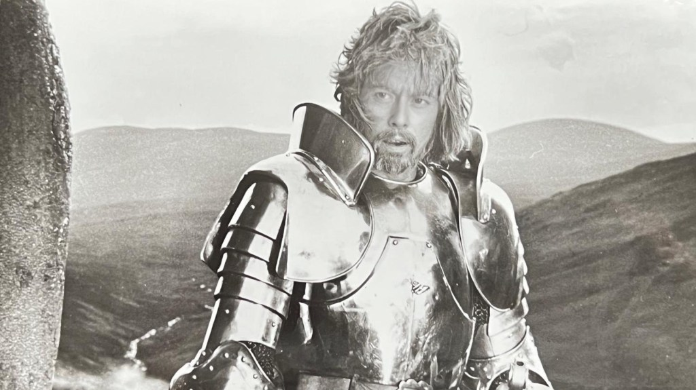
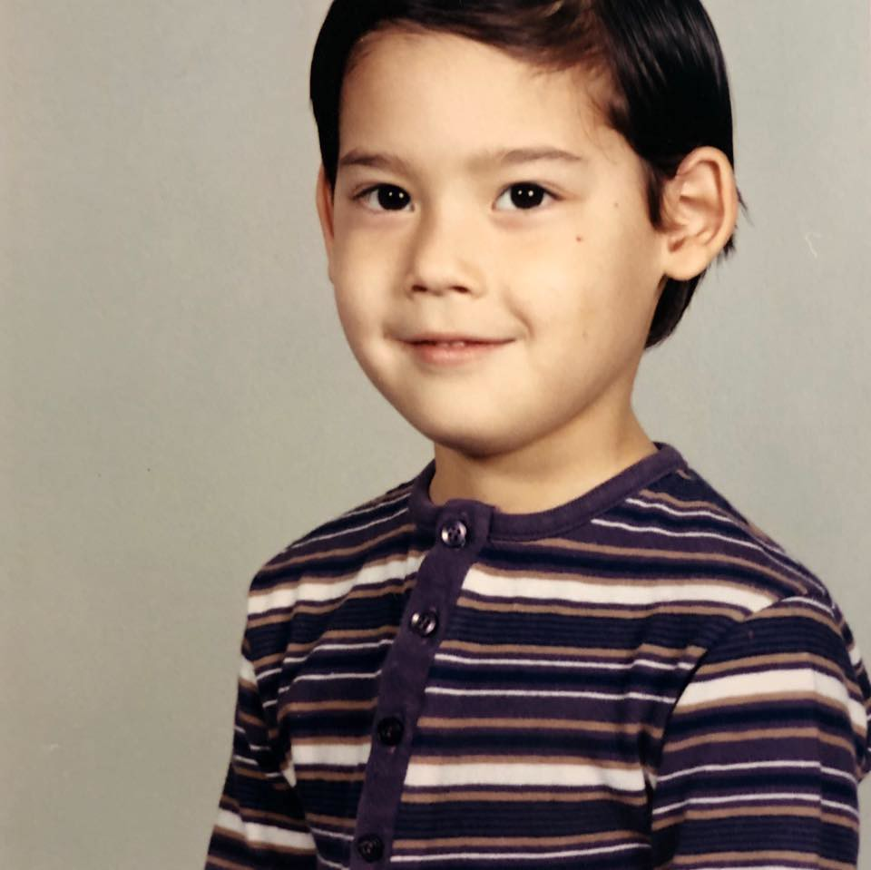

> For You formed my inward parts; You wove me in my mother’s womb. I will give thanks to You, for I am fearfully and wonderfully made; Wonderful are Your works, And my soul knows it very well.
> 
> Jeremiah 139:13-14

I was born during a winter snowstorm in Maine, USA, just in time for dinner. My father was an Air Force pilot from a small town in West Virginia and my mother was a delicate flower from Tokyo, Japan that was an avid artist.

### **What's in a name?**

My parents named me Glenn Arthur Kelly. Each name had a special reason for why they were chosen.

My first name Glenn was for John Glenn the astronaut and Pastor William Glenn Harris that was my Father's Uncle.

<figure>

<figcaption>

John Glenn the astronaut

</figcaption>

</figure>

My middle name Arthur was for King Arthur and General Douglas MacArthur.

<figure>

<figcaption>

King Arthur from the movie Excalibur

</figcaption>

</figure>

<figure>

<figcaption>

General Douglas MacArthur

</figcaption>

</figure>

Quite a name to live up to!

### **Earliest memories**

One of my earliest memories comes from when I was a little over one year old and was in our house when we lived in Okinawa. I remember the house and playing outside.

When I was three to seven years old I lived in Japan as my dad was stationed there. I remember playing in the streets of Tokyo with the neighbor kids and my cousins. I remember school and how much from the very beginning I liked girls and wanted to protect them in the playground.

<figure>

<figcaption>

Childhood photo

</figcaption>

</figure>

I would ride my bike and climb trees and catch bugs. I loved when my dad would come home from work in his flight suit and would throw a football and we would play catch together.

I was not raised with any specific religious teaching. In subsequent posts in the [Faith](https://glennkelly006.wordpress.com/category/faith/) section of the site I will explore different topics from my past that have influenced and continue to influence me today.

If you live in the area or are visiting come worship with us at [Oak Hill Bible Church](http://oakhillbible.com).

<figure>

<figcaption>

Click image to go to the Oak Hill Bible Church YouTube Channel

</figcaption>

</figure>

For amazing Bible teaching and resources to apply biblical discernment to all you do subscribe to the [Oak Hill Bible Church YouTube channel](https://www.youtube.com/channel/UCsLyjUBBEVGLxS5q-oiJ6Qw?sub_confirmation=1).
