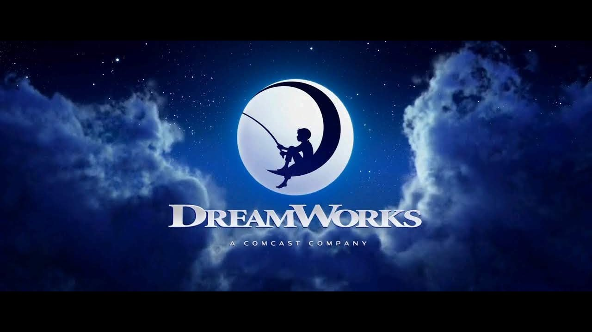
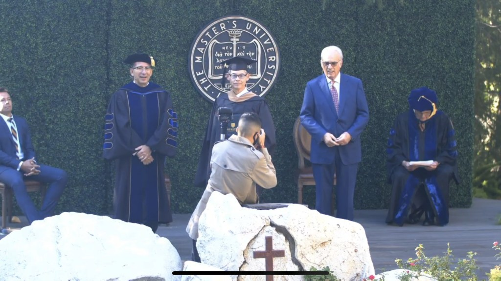
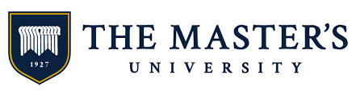
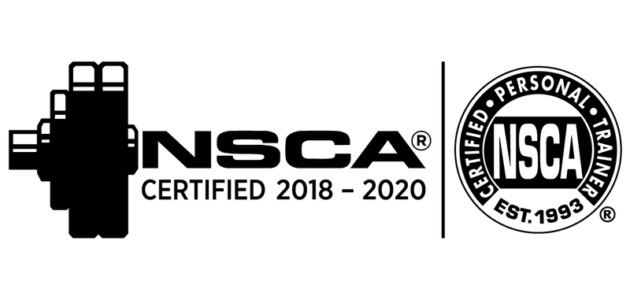
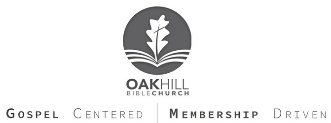

> > I press on toward the goal for the prize of the upward call of God in Christ Jesus.
> > 
> > Philippians 3:14

I am constantly a work in progress, trying to better myself in all aspects of my life. First and foremost I endeavor to serve the Lord Jesus Christ so that he is honored in my thoughts and actions.

Together with my wife, and two daughters we live in Los Angeles, California where we are members of a wonderful local church family [@Oak Hill Bible Church](http://oakhillbible.com) where I serve in the Audio/Video ministry and answer the call whenever the Oak Hill Deacon Beacon is projected in the sky.

<figure>

<figcaption>

Click logo to go to Oak Hill Bible Church YouTube Channel

</figcaption>

</figure>

In 2015 I joined DreamWorks as a Technology Manager and currently work as a Program Manager in the Project Management Office (PMO) that reports to the Chief Technology Officer (CTO) of the studio.

<figure>

<figcaption>

Click logo to go to Glenn Kelly's IMDB Entry

</figcaption>

</figure>

Taking advantage of the tuition reimbursement program at work I completed my Master's in Business Administration (MBA) from The Master's University (TMU) in December 2019.

<figure>

<figcaption>

Click logo to go to TMU's website

</figcaption>

</figure>

In 2020 I renewed my focus on physical fitness and started working out consistently and watching what I eat. For fun I took a free online prep course for being a Certified Personal Trainer from College of the Canyons. I did not take the certification test as it is quite expensive but I definitely learned a lot from the course!

<figure>

<figcaption>

Click logo to go to NSCA website

</figcaption>

</figure>

I'm currently developing a podcast that I hope will be a way to connect and communicate with people around the world and develop a community, a place to gather and share stories and be able to encourage one another.

As you will see one of the consistent themes in my life is that I'm constantly learning.

For amazing Bible teaching and resources to apply biblical discernment to all you do subscribe to the [Oak Hill Bible Church YouTube channel](https://www.youtube.com/channel/UCsLyjUBBEVGLxS5q-oiJ6Qw?sub_confirmation=1).

<figure>

<figcaption>

Click image to go to the Oak Hill Bible Church YouTube Channel

</figcaption>

</figure>
