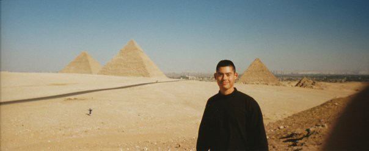
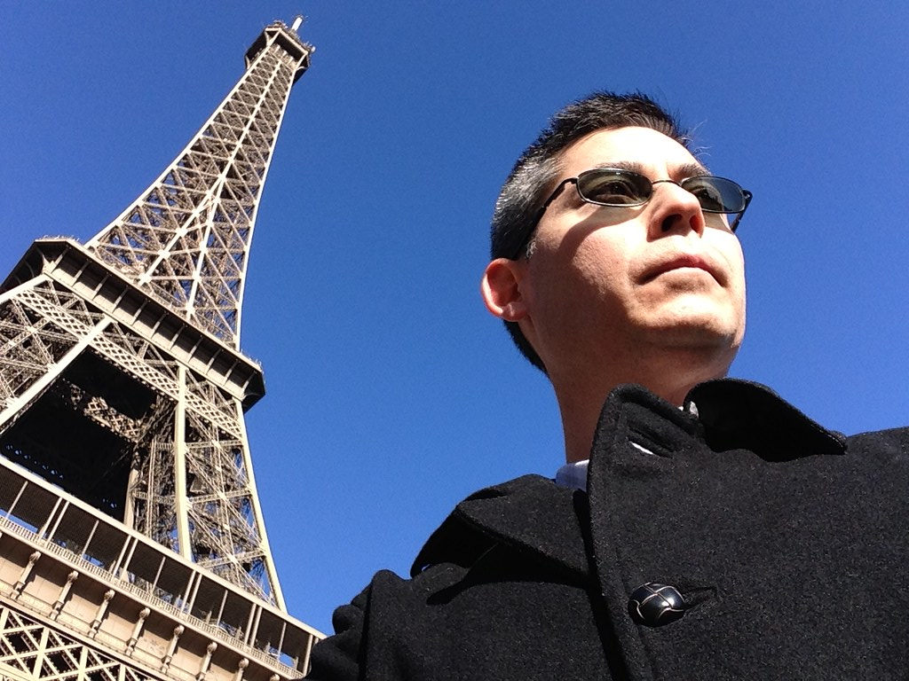
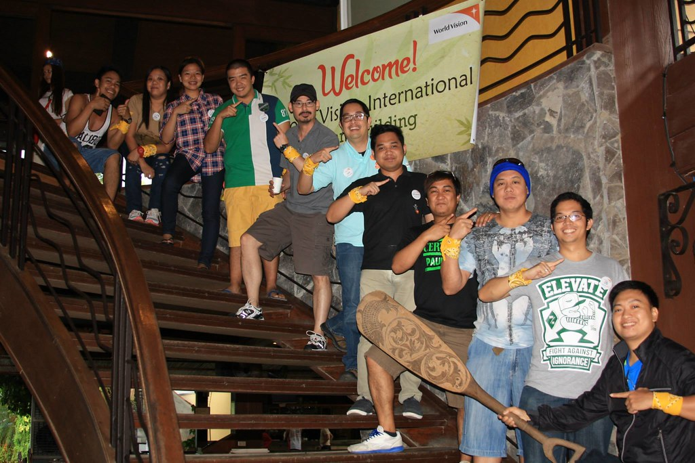
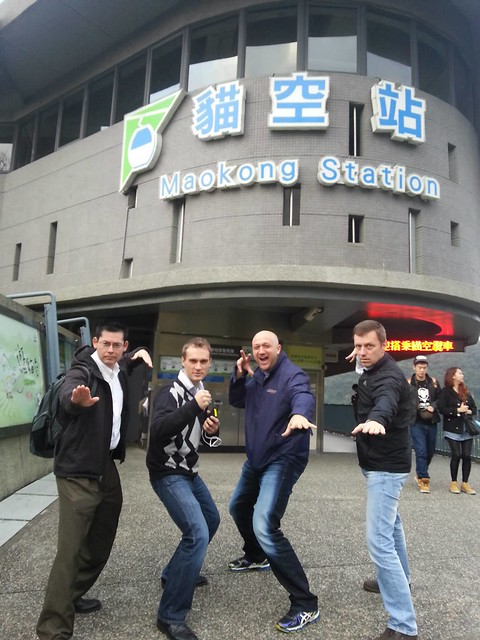

> For since the creation of the world His invisible attributes, His eternal power and divine nature, have been clearly seen, being understood through what has been made, so that they are without excuse.
> 
> Romans 1:20

Our home planet Earth is an amazing place, filled with breathtaking beauty and splendor. I fortunately have had the opportunity to visit many sites around the world growing up, on vacations, during my military operations, and business travel.

### Some places I've visited

- Brazil

- Canada

- China

<figure>

<figcaption>

Egypt

</figcaption>

</figure>

<figure>

<figcaption>

France

</figcaption>

</figure>

- Germany

- Hong Kong

- Japan

- Macau

- Mexico

- Okinawa

- Panama

<figure>

<figcaption>

Philippines

</figcaption>

</figure>

- South Korea

<figure>

<figcaption>

Taiwan

</figcaption>

</figure>

<figure>

<figcaption>

United Kingdom

</figcaption>

</figure>

- United States

There are so many different places I would love to visit. Some of my top picks are in the next section.

### Dream Destinations

<figure>

<figcaption>

Australia

</figcaption>

</figure>

<figure>

<figcaption>

Fiji

</figcaption>

</figure>

<figure>

<figcaption>

Greece

</figcaption>

</figure>

- Iceland

<figure>

<figcaption>

Israel

</figcaption>

</figure>

<figure>

<figcaption>

Italy

</figcaption>

</figure>

<figure>

<figcaption>

New Zealand

</figcaption>

</figure>

- Spain

<figure>

<figcaption>

Switzerland

</figcaption>

</figure>

### Great Memories of People

During my travels what I primarily take home with me are the interactions with the people. The great memories are of the times spent with colleagues, family, or making new friends.

My hope is that you will be able to visit and travel around the world and see how beautiful and special our planet is.

### **What are your dream destinations?**

If you live in the area or in your travels are visiting Southern California come worship with us at [Oak Hill Bible Church](http://oakhillbible.com).

<figure>

<figcaption>

Click image to go to the Oak Hill Bible Church YouTube Channel

</figcaption>

</figure>

For amazing Bible teaching and resources to apply biblical discernment to all you do subscribe to the [Oak Hill Bible Church YouTube channel](https://www.youtube.com/channel/UCsLyjUBBEVGLxS5q-oiJ6Qw?sub_confirmation=1).
