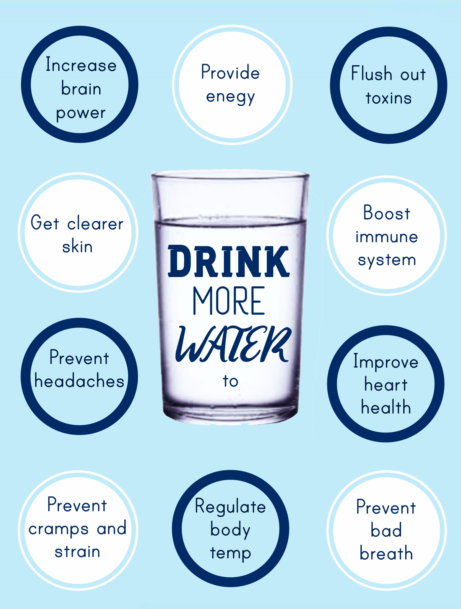
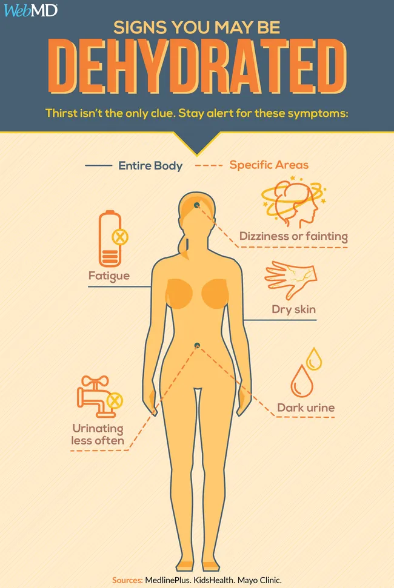
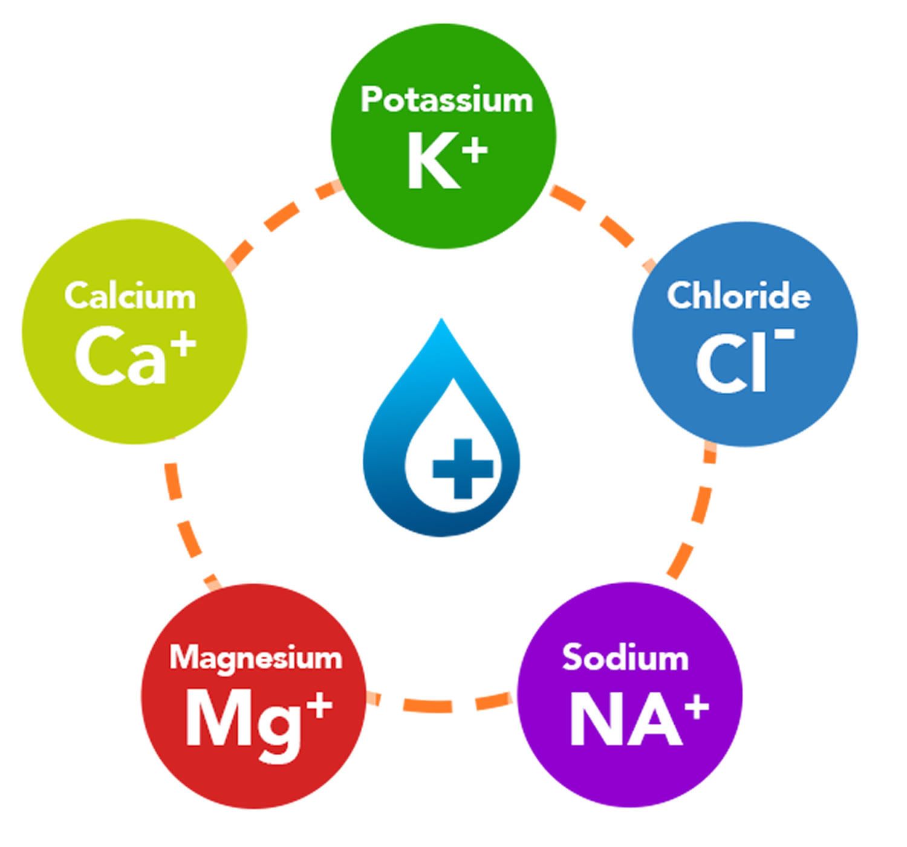
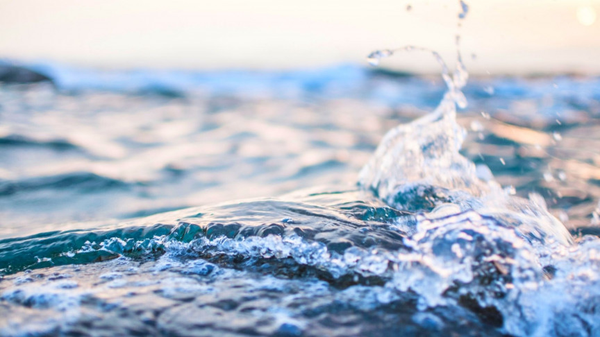
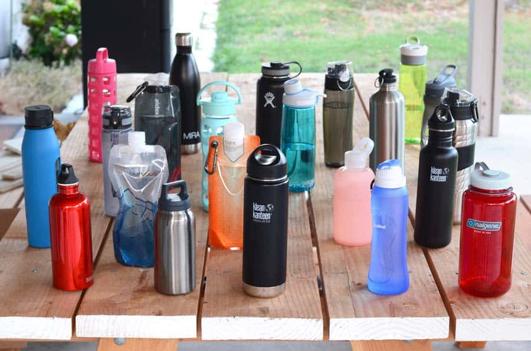
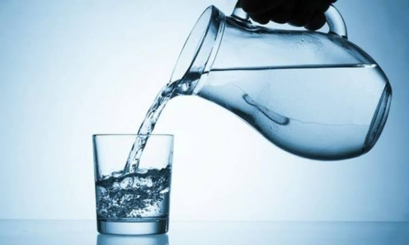

> He who believes in Me, as the  
> Scripture said, ‘From his innermost  
> being will flow rivers of living water.’”
> 
> John 7:38

This post shares what I have learned about why drinking water everyday is important, what happens if you have too much or too little water, what are electrolytes, how much water should you drink, what is the healthiest water to drink, what container should you drink it in, and what the best times are to drink water. At the end of the article I briefly explain what "living water" is from the Bible quote above which is actually even more important than drinking water is for our life!

### Why drinking water is important

Around 60% of your body is made up of water and our blood is 90% water. Water is essential for the kidneys and other bodily functions, without drinking water we would become dehydrated and die in a matter of days. Here is a list of 15 benefits of drinking water everyday (from [MedicalNewsToday](https://www.medicalnewstoday.com/articles/290814#kidney_damage)):

1. Lubricates your joints (cartilage, found in joints and the disks of the spine, contains around 80% water)

3. Forms saliva and mucus (which helps us digest our food and keeps the mouth, nose, and eyes moist, preventing friction and damage)

5. Delivers oxygen throughout the body through your blood

7. Boosts skin health and beauty (with dehydration your skin becomes more vulnerable to skin disorders and premature wrinkling)

9. Cushions the brain, spinal cord, and sensitive tissues

11. Regulates body temperature

13. Your digestive systems depends on it

15. Flushes body waste

17. Helps maintain blood pressure

19. Your airways need it

21. Makes minerals and nutrients accessible

23. Prevents kidney damage

25. Boosts your performance during exercise

27. Helps with weight loss

29. Reduces the chance of a hangover from overconsumption of alcohol

### Too much water?

Did you know that drinking too much water can actually be harmful to you? When you drink too much water it is called overhydration.

> When you drink too much water, you may experience water poisoning, intoxication, or a disruption of brain function. This happens when there's too much water in the cells (including brain cells), causing them to swell. When the cells in the brain swell they cause pressure in the brain.
> 
> [What Happens When You Drink Too Much Water? - WebMD](https://www.webmd.com/diet/what-is-too-much-water-intake)

Sodium is a crucial element that helps keep the balance of fluids in and out of your body's cells. Sodium is the electrolyte most affected by overhydration that leads to a condition called hyponatremia.

> When its \[sodium\] levels drop due to a high amount of water in the body, fluids get inside the cells. Then the cells swell, putting you at risk of having seizures, going into a coma, or even dying.
> 
> [What Happens When You Drink Too Much Water? - WebMD](https://www.webmd.com/diet/what-is-too-much-water-intake)

### Too little water?

Dehydration happens when your body does not have as much water as it needs. Without enough water, your body cannot function properly. The following diagram shows some warning signs of not drinking enough water:

<figure>

<figcaption>

[What is Dehydration? What Causes It? - WebMD](https://www.webmd.com/a-to-z-guides/dehydration-adults)

</figcaption>

</figure>

Depending on how much fluid is missing from your body you can have mild, moderate, or severe dehydration. Dehydration is very serious, to learn more click the image above to take you to the WebMD article "What is Dehydration? What Causes It?"

### What are electrolytes?

Electrolytes are minerals that are essential for your body to help regulate your pH levels and muscles, keep you hydrated, and more. Some of the common electrolytes found in the body are in the diagram below:

Each of these minerals shown in the diagram above carry an electric charge when dissolved in the body, giving them their name as an electrolyte.

> The amount of water in your body needs to be in balance with your electrolyte levels. Dehydration from diarrhea, sweating, and liver problems can upset that balance. Maintaining an adequate intake of both substances is fundamental to good health.
> 
> [Healthy Foods High in Electrolytes - WebMD](https://www.webmd.com/diet/foods-high-in-electrolytes)

### How much water should I drink?

Unfortunately there is no simple one size fits all answer to this question. We often hear that we should drink at least eight glasses of water a day. Per the U.S. National Academies of Sciences, Engineering, and Medicine the adequate daily fluid intake is:

- **For men**: About 15.5 cups (3.7 liters) of fluids a day

- **For women**: About 11.5 cups (2.7 liters) of fluids a day

However you might need to modify your total fluid intake based on several factors:

- **Age, gender, weight** - Your body needs different amounts of water if you are one year old or a 100 years old, whether you are a man or a woman, or weigh 100 lbs or 250 lbs.

- **Exercise** - You need to drink extra water to cover the fluid loss from sweat.

- **Environment** - Hot or humid weather can make you sweat and requires additional fluids. Dehydration can also occur at high altitudes.

- **Overall health** - If you are ill your body loses fluids when you have a fever, are vomiting or have diarrhea.

- **Pregnancy and breast-feeding** - If you are pregnant or breast-feeding you may need additional fluids to stay hydrated.

A couple of indicators that you probably have adequate fluid intake are if:

1. You rarely feel thirsty

3. Your urine is colorless or light yellow

Keep in mind that you don't need to rely only on water to meet your fluid needs. What you eat also provides a significant portion. Beverages such as milk, juice and herbal teas are composed of mostly water. Even coffee and soda can contribute to your daily water intake.

> Please consult a doctor or dietician to help you determine the amount of water that is right for you every day.

### What is the healthiest water to drink?

There are so many different types of water. In the table below I have listed the top 10 most common types of water and their pros and cons.

|   **Type**   |   **Pros**   |   **Cons**   |
| --- | --- | --- |
|   **Tap**   |   \- Widely available   \- Low cost   \- Disinfected with chlorine or chloramine   |   \- May contain traces of contaminants   |
|   **Well**   |   \- Often has high content of essential minerals   \- Free of impurities added to municipal drinking water supplies   |   \- Usually contains harmful   contaminants   \- Can pose serious health risks if untreated   |
|   **Glacier or Spring**   |   \- Contain essential   minerals   \- Should be free   of tap water   contaminants   |   \- May contain   harmful   contaminants   \- More expensive   |
|   **Mineral**   |   \- Higher pH as   it contains high   concentrations of magnesium,   calcium, and silica   |   \- Costs more   \- Some contain large amounts of sodium and/or sulfates   |
|   **Sparkling**   |   \- Contain minerals   \- Taste encourages hydration   |   \- Many contain sugars/sweetners   \- Some add sodium   |
|   **Infused or Flavored**   |   \- Some add beneficial antioxidants   \- Can make your own   \- Enjoyable flavor encourages hydration   |   \- Many have added sugars/ sweetners   \- Many add sodium   |
|   **Purified**   |   \- Completely free from impurities   \- One of the safest forms of water   |   \- No beneficial minerals and electrolytes   \- lower pH, more likely to pick up heavy metals from containers   |
|   **Filtered**   |   \- Free from a range of impurities   \- Still contains healthy minerals   \- Filtering own water supply more affordable than buying bottled   |   \- Might have high mineral content   \- Contains trace contaminants   |
|   **Distilled**   |   \- Purest form of H2O   \- Free of impurities   |   \- Lacks minerals and electrolytes   \- Has an unnatural, flat taste   |
|   **Alkaline**   |   \- Sellers suggest it can help your overall pH balance   |   \- Little evidence of sellers claims   \- Some health risks reported   |

> The healthiest water to drink is filtered or mineral water.

Filtered or mineral drinking water is free from contaminants but still contains a good amount of healthy minerals and electrolytes. Other healthy waters are soda water and infused water, as long as these do not have added sodium, sugars, or sulfates.

All types of water have their pros and cons. For instance, purified water is technically very healthy because it lacks all dangerous contaminants, but it also lacks beneficial minerals. You will need to determine for yourself which type of water is best for you.

### Does it matter what you put your water in?

The short answer is Yes! When I was a kid I used to drink water out of the garden hose, which in hindsight was probably not the best idea. Plastic bottles are made using a chemical compound known as polyethylene terephthalate (PET) that acccording to several studies, can contaminate water. The American Academy of Pediatrics (AAP) points out that bisphenol A (BPA), which is used to harden plastic containers and to line metal cans, "can act like estrogen in the body and potentially change the timing of puberty, decrease fertility, increase body fat, and affect the nervous and immune systems." There are a plethora of research articles and web sites that debate this, however the bottom line is the healthier choice is to avoid the risks of drinking from plastic containers.

> The recommended containers to put your water in are glass, porcelain or stainless steel.

### Best timing to drink water

|   **After you sleep**   |   Because you don't drink while   you're sleeping you wake up   already dehydrated and need to   replenish your fluids.   |
| --- | --- |
|   **Before meals**   |   Drink water 30 minutes before   your meals as this aids in   digestion and can help prevent   overeating.   |
|   **After meals**   |   Drink water 1 hour after meals to   aid digestion.   |
|   **When tired or sick**   |   When you feel tired/sick or have a   headache this can be a symptom of   dehydration. Increasing water   intake helps to flush out toxins and   bacteria from your body and may   help decrease headache severity.   |
|   **When you exercise**   |   Depending upon how intense your   planned workout is going to be you   may need to begin your hydration   strategy a day or two or even one   week before an endurance race.   During exercise sip water, and be   sure to hydrate well after your   exercise to replace what you have   lost through sweat.   |
|   **Before bathing**   |   Drink water before taking a hot   bath/shower as it helps to regulate   your body temperature and helps   lower your blood pressure.   |
|   **Before bed**   |   Drink water 1 hour before going to bed.   |
|   **When thirsty**   |   Whenever you are thirsty have   some water. It is also good to have   water handy so if you wake up   thirsty during the night you will   have it right there.   |

### Living Water

The phrase "living water" is in two instances in the Bible. In John 4:10 where Jesus was speaking with the Samaritan woman at the well, "Jesus answered and said to her, “If you knew the gift of God, and who it is who says to you, ‘Give Me a drink,’ you would have asked Him, and He would have given you living water.” And from John 7:38 quoted at the beginning of this post. Living Water is referring to the Holy Spirit that Jesus gives to those that believe in him as their Savior and Lord who will inherit eternal life. Nothing in life is more important than this.

#### Final Thoughts & Encouragement

- If you live in the area or are visiting come worship with us at [Oak Hill Bible Church](http://oakhillbible.com)

<figure>

<figcaption>

Click image to go to the Oak Hill Bible Church YouTube Channel

</figcaption>

</figure>

- For amazing Bible teaching and resources to apply biblical discernment to all you do subscribe to the [Oak Hill Bible Church YouTube channel](https://www.youtube.com/channel/UCsLyjUBBEVGLxS5q-oiJ6Qw?sub_confirmation=1).
